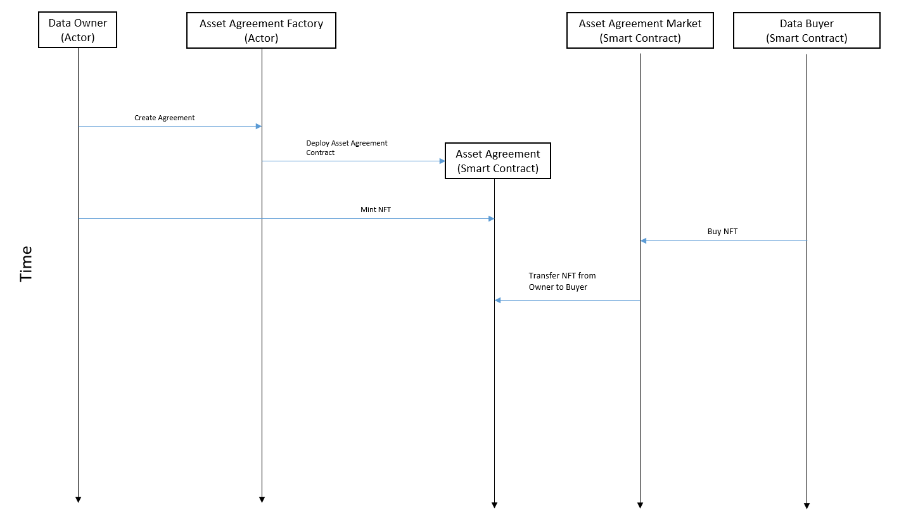

# NFT Data Exchange Market Demo

## Introduction

The NFT Data Exchange Market Demo is a proof of concept 

## Smart Contract Design
There are three smart contracts used by this market. The first contract is the 
Factory contract (`AssetAgreementFactory.sol`), it acts as a owner registration 
form. It allows new data owners who intend to sell their data on our market to 
register. This Factory contract deploys a new Asset Agreement contract that has 
the owner's wallet address attached to it. This contract is managed both by the 
owner and the market contract. The second contract is the Asset Agreement 
contract (`AssetAgreement.sol`), this contract forms a one to many relationship 
with owners and buyers respectively. Every time a buyer wishes to buy some 
asset on the market, the market interacts with the respective buyer's Asset 
Agreement contract and transfers the bought asset from the owner's possesion to 
the buyer's posession. It is also the contract used by the respective data 
owners to mint new assets for sale. Finally the third contract is the Asset 
Market contract (`AssetMarket.sol`), this is the contract that all buyers 
interact with when they wish to purchase an asset. The market contract acts on 
behalf of the buyer and communicates with the respective owner's Asset 
Agreement contract to validate the purchase and transfer posession of goods.

The following is a timeline of the events from the perspective of the smart 
contracts




## Ethereum Node Endpoints

Start the local endpoint using `npx hardhat node`. For the demo, you do not need
to worry about this, the bootstrap.py script will exec a hardhat node for you.
```
LOCAL_ETH_ENDPOINT = "http://127.0.0.1:8545/"
```

This is the private key of a ETH Wallet that has a little Goerli Testnet ETH to
work with. It is only used in `cli.py` to measure test net performance. The demo
works strictly off a local ethereum node. 
If the ETH in the wallet runs out, use a ETH Faucet to refill. 
I used [this one](https://goerlifaucet.com/).

The corresponding wallet address: `0x950767568F7E5560333f4d0D3120a43ebD7c236F`
```
GOERLI_TEST_ACCOUNT_PRIVATE_KEY = "0320072181e1ba70ecd8b9ac11500cda0d1b7c9a1c73d9e2ef59b76524f16e02"
```

This a endpoint provided by [https://www.infura.io/](https://www.infura.io/). It 
is the endpoint currently used to measure test net performance in `cli.py`
```
INFURA_GOERLI_ENDPOINT = "https://goerli.infura.io/v3/1f6bc018b78440dba6b8b0cafc36e912"
```

Alchemy endpoints. I have never used these. They were given to me.
```
ALCHEMY_GOERLI_ENDPOINT = "https://eth-goerli.g.alchemy.com/v2/fTYyXArUCpY8yDBdvMgi9CTtQHNQdvjC"
ALCHEMY_TEST_ACCOUNT_PRIVATE_KEY = "ca29dd62b1dddb3a95936f13e044612f6b4665f64ee83acadcdd2e2c686f7d19"
```

## Codebase
```
$ tree -I "node_modules|__pycache__|images|artifacts|decrypted|cache"
.
├── archived
│   ├── contracts
│   │   ├── AssetAgreementERC1155.sol
│   │   └── IAssetAgreementERC1155.sol
│   └── src
│       ├── buyer_registration.py
│       ├── cli.py
│       ├── cli_utils.py
│       ├── decrypt.py
│       ├── obs_file_upload.py
│       └── owner_registration.py
├── assets
│   └── smartcontract_timeline.png
├── bootstrap.sh
├── contracts
│   ├── AssetAgreementFactory.sol
│   ├── AssetAgreement.sol
│   ├── AssetMarket.sol
│   └── IAssetAgreement.sol
├── contracts.json
├── format.sh
├── hardhat.config.js
├── package.json
├── package-lock.json
├── poetry.lock
├── pyproject.toml
├── README.md
├── requirements.txt
└── src
    ├── app.py
    ├── constants.py
    ├── contract.py
    ├── dashboard.py
    ├── db
    │   ├── demo.db
    │   └── schema.sql
    ├── db.py
    ├── extract_watermark.py
    ├── __init__.py
    ├── market.py
    ├── plots
    │   ├── batchmint_gas_plot.py
    │   ├── contract_local.py
    │   ├── deploy_gas_plot.py
    │   ├── gas_method.py
    │   └── registration_trade_plot.py
    ├── provider.py
    ├── ssl_watermarking
    │   ├── build_normalization_layer.py
    │   ├── carriers
    │   │   ├── carrier_17_2048.pth
    │   │   ├── carrier_21_2048.pth
    │   │   └── carrier_24_2048.pth
    │   ├── data_augmentation.py
    │   ├── decode.py
    │   ├── encode.py
    │   ├── evaluate.py
    │   ├── __init__.py
    │   ├── input
    │   │   └── 0
    │   ├── LICENSE
    │   ├── main_0bit.py
    │   ├── main_multibit.py
    │   ├── models
    │   │   └── dino_r50_plus.pth
    │   ├── normlayers
    │   │   └── out2048_yfcc_orig.pth
    │   ├── output
    │   │   └── imgs
    │   ├── README.md
    │   ├── requirements.txt
    │   ├── utils_img.py
    │   └── utils.py
    ├── upload.py
    ├── user_registration.py
    └── utils.py

16 directories, 60 files
```

## How to Run

1.  First create the Poetry environment
    ```sh
    poetry install
    ```
2.  Install node dependencies. Please ensure you are using Node v16.14.0
    ```sh
    npm install
    ```
3.  We need to setup the Watermarking ML models. Download the files belows and 
    place them in the respective directories

    **Place in `~/.cache/torch/hub/checkpoints`**

    Resnet50: https://download.pytorch.org/models/resnet50-0676ba61.pth

    **Place in `ssl_watermarking/models`**

    DINO Trained Resnet 50: 
    https://dl.fbaipublicfiles.com/ssl_watermarking/dino_r50_plus.pth

    **Place in `ssl_watermarking/normlayers`**

    Normalization Layer: 
    https://dl.fbaipublicfiles.com/ssl_watermarking/out2048_yfcc_orig.pth

4.  To launch the demo application, make sure the Conda environment from step 1 
    is activated. Then run
    
    ```sh
    python bootstrap.py
    ```
    This should compile the smart contracts, start up a local ethereum hardhat 
    node and start the streamlit server.
    
    Once everything is up and running, visit the address shown in the terminal 
    output.

# Data Exchange Market Metrics CLI

